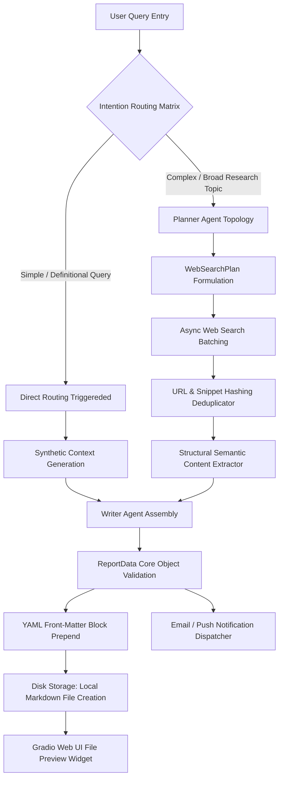

# Deep Research Agentic Pipeline 🚀

An autonomous, multi-agent deep research application to ingest complex user queries, programmatically orchestrate execution strategies, crawl web endpoints concurrently, and compile publication-grade intelligence reports. 

The base code is from https://github.com/ed-donner/agents.

Equipped with advanced **Inference Engineering** layers, the system minimizes API latency, controls token cost overhead, and persists structured research outputs natively.

---

## 🏗️ Architectural Topology & Flow

The system runs on a highly adaptive pipeline that splits into a fast-track route for simple requests and a fully articulated multi-agent search framework for deep investigations.



---

## ⚡ Core Infrastructure Components & Optimizations

### 1. Intention Routing Engine
Before spinning up expensive search routines, the `ResearchManager` evaluates incoming prompts against an automated lexical mapping grid.
* **Low-Latency Classifier:** Catches direct factual lookups, definition queries, or single-phrase topics matching structural templates.
* **Fast-Track Bypassing:** Simple queries cut straight to final report generation via parametric knowledge weights—dropping execution intervals from ~30+ seconds down to **under 3 seconds**.

### 2. Streamlined Text Optimization (Deduplication & Pre-Filtering)
When treating deep search clusters, web nodes frequently return redundant metadata or high-volume noise profiles.
* **MD5 Token Hashing:** Evaluates incoming result data string hashes. Identical responses are deleted immediately to avoid double-processing.
* **Semantic Fragment Extraction:** programmatically purges script blocks, style definitions, and tracking elements. Heuristic length evaluation keeps sentences rich in information (5–45 words) while hard-capping contexts to prevent context bloat inside the **Writer Agent**.

### 3. Local Markdown Storage Layer (`generated/`)
Every compiled report drops automatically into persistent storage as a standardized Markdown file (`.md`).
* **Filenames are URL-Sanitized:** Formed directly using low-character expressions extracted from the user's initial prompt string.
* **Overwrites Prevented:** Appends a millisecond-accurate timestamp identifier string (`%Y%m%d_%H%M%S`) to secure clear storage versioning history.

### 4. Structured YAML Front-Matter Meta Injection
Every local asset starts with a production-ready, key-value configuration block wrapped inside valid `---` dividers. This enables instant integration with static site parsers (such as Hugo, Obsidian, Jekyll, or Docusaurus) out of the box:
```yaml
---
date: "2026-09-17 00:05:12"
query: "How do custom consensus mechanisms work in enterprise blockchains?"
trace_id: "tr_a5b82e14f9d3"
---
```

### 5. Interactive Gradio Interface Integration
The web layout integrates an immediate browser file tracker overlay:
* **`gr.File()` Preview Component:** Dynamically shifts from hidden states to visible layouts the exact moment disk writing finishes.
* **Direct Download Delivery:** Users can review, explore, or download raw markdown output assets directly from the browser view without checking command lines or filesystem panels.

---

## 🛠️ Quickstart

1. **Install Dependencies:**
   ```bash
   pip install -r requirements.txt
   ```
2. **Launch Development Application Environment:**
   ```bash
   python app.py
   ```
3. **Locate Generated Artifact Bundles:**
   Review generated research entries within the local project system container space at: `./generated/`
